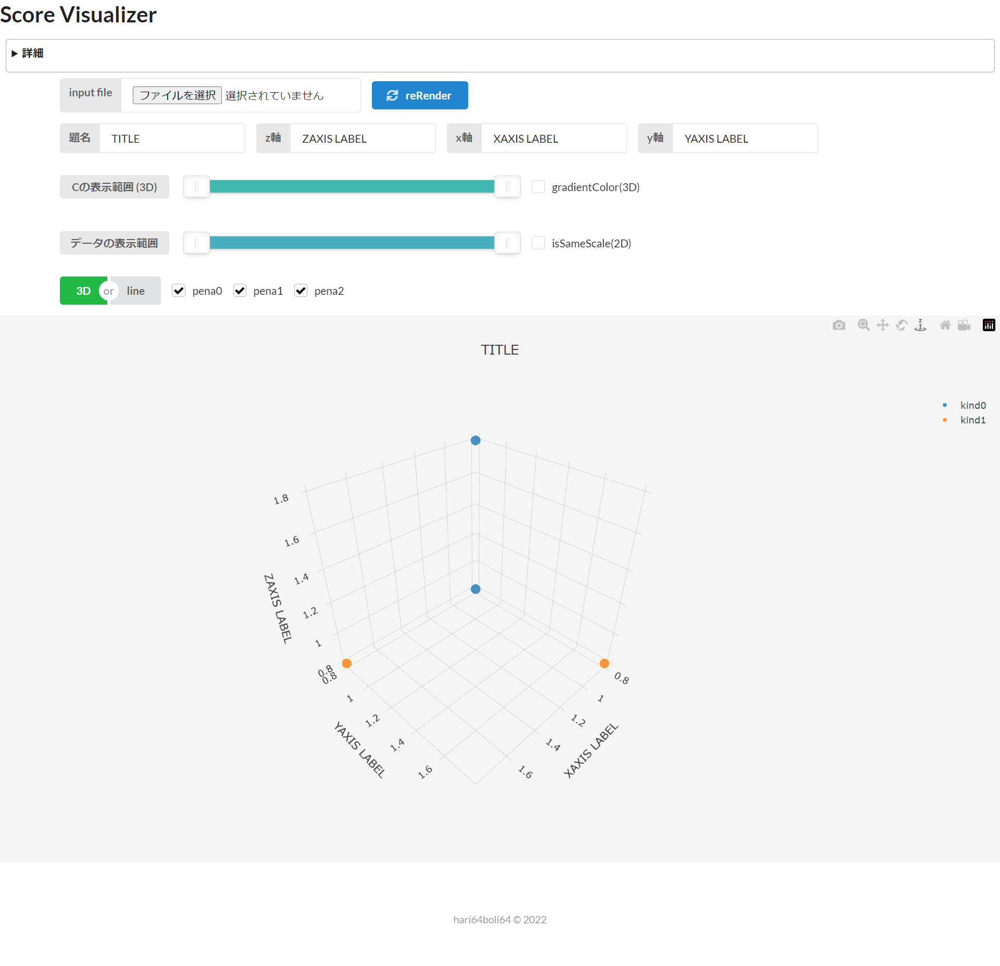

# Score Visualizer

## Image

## About

このビジュアライザは、ソルバーが算出した複数のペナルティ同士の関係性を図示するためのものです。
**input file**には以下の形式のデータを与えて下さい。

>$$
\begin{align*}
&N\ M\ (Title\ Label_1\ Label_2\ ...\ Label_M)\\
&p_{11}\ p_{12}\ ...\ p_{1M}\ (c_1)\\
&p_{21}\ p_{22}\ ...\ p_{2M}\ (c_2)\\
&p_{31}\ p_{32}\ ...\ p_{3M}\ (c_3)\\
&...\\
&...\\
&p_{N1}\ p_{N2}\ ...\ p_{NM}\ (c_N)\\
\end{align*}
$$

ただし、

* $N$はデータの総数(int)
* $M$はペナルティの種類数(int)(要望さえあれば種類数は5つより大きく増やせます)
* $Title,Label_i$はグラフの題名、及び、i番目に重要なペナルティの名前(string)(optional)
* $p_{ij}$はi番目のデータのj番目に重要なペナルティの値(int or float)
* $c_i$はi番目のデータの色付け(int or float)(optional)

とします。

---

見やすさのため、

* Z軸に1番重要なペナルティ
* X軸に2番重要なペナルティ
* Y軸に3番重要なペナルティ

としています。

なので、下に位置するデータであればあるほど基本的には良い解となります。

---

gradientColorという機能を付けてみました。このチェックボックスにチェックすると、入力でcが与えられている場合、その値に比例して色が緑から赤へとグラデーションします。

---

このビジュアライザはPlotly.jsというライブラリを使用して作成されました。
グラフの右上に色々ボタンがあると思いますが、それらで視点移動などが可能です。
また、右側にある凡例は、クリックやダブルクリックで表示・非表示を切り替えられます。
表示範囲という名前で用意したスクロールバーと合わせて、どの種類のデータを描画するかの切り替えを行ってください。

また、3D/Lineという二種類の描画方式を用意しましたが、

* **3D** : 三次元散布図 描画対象が3つのみという制約があるが、同じ種類間の分布などを見るのに最適
* **Line** : 折れ線グラフ 種類の情報を図には反映させていないが、時系列的なスコア関数の描画が可能

という違いが存在します。

---

バグや要望等があれば、hari64boli64まで。

挙動が変だな? と思った場合、[開発者用ツール](https://developer.mozilla.org/ja/docs/Learn/Common_questions/What_are_browser_developer_tools)を見ると解決する場合があったり、報告いただく際に私が楽になったりします。
